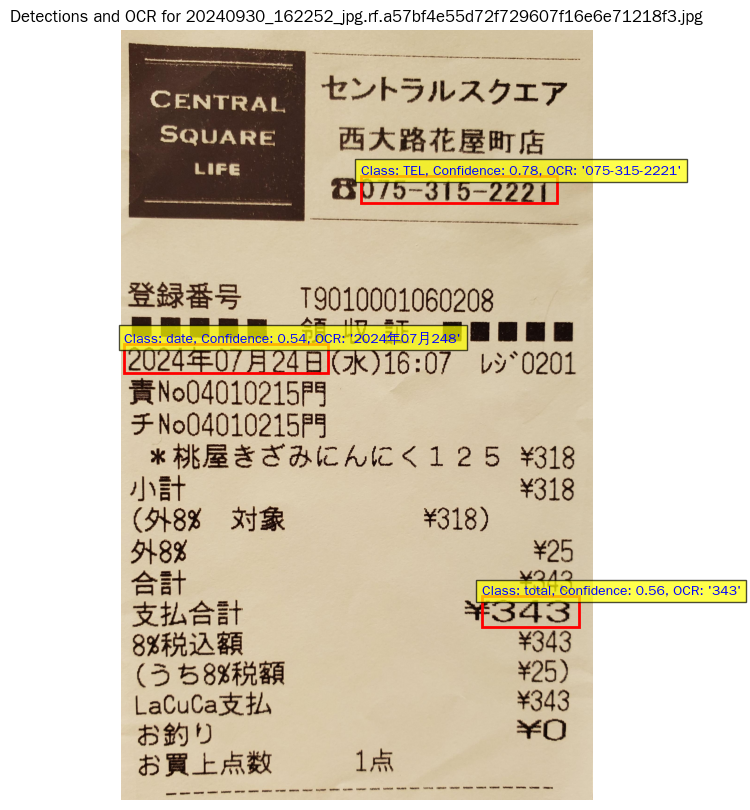

# YOLOv11 & EasyOCR スマートレシート認識システム

## 1. プロジェクト概要

<table>
  <tr>
    <td></td>
  </tr>
</table>

本プロジェクトは、YOLOv11 物体検出モデルと EasyOCR（光学文字認識）技術を組み合わせたスマートレシート認識システムの開発を目的としています。  
レシート画像内の重要情報（電話番号・日付・合計金額など）を自動抽出し、画像中の対象領域を高精度で検出した上でテキストを認識します。

日本語および英語の多言語認識に対応しており、認識結果は可視化インターフェースを通じて分かりやすく表示されます。

---

## 2. 主な成果とポイント

- **高精度なモデル性能**：YOLOv11 モデルは検証データセットにおいて `mAP50 = 0.976`、`mAP50-95 = 0.66` を達成し、レシート内の重要項目を高精度に検出可能であることを確認しました。  
- **エンドツーエンド統合システムの構築**：YOLOv11 の高精度物体検出と EasyOCR の多言語OCR機能を統合し、完全自動化された情報抽出システムを実装しました。  
- **日本語表示問題の解決**：`matplotlib` のフォント設定を最適化することで、日本語文字の文字化けや欠落問題を解決し、認識結果を正確に可視化できるようにしました。  
- **柔軟な閾値調整**：検出信頼度の閾値を下げることで、潜在的な対象をより多く検出可能であり、用途に応じた柔軟な運用が可能です。  

---

## 3. 環境構築

本プロジェクトを実行するために、以下のライブラリをインストールしてください。`pip` の使用を推奨します。

```bash
pip install "ultralytics<=8.3.40" supervision roboflow easyocr opencv-python matplotlib numpy
# ultralytics のトラッキング機能を無効化
yolo settings sync=False

# matplotlib 用の日本語フォントをインストール
sudo apt-get update -qq
sudo apt-get install -y fonts-wqy-zenhei
```

### 注意事項

- `ultralytics` のバージョンは互換性確保のため `8.3.40` に固定しています。  
- `easyocr` は初回実行時にモデルファイルを自動ダウンロードします。インターネット接続をご確認ください。  
- `matplotlib` の日本語フォント設定は、実行環境によって追加設定が必要な場合があります。  

---

## 4. データ準備

本プロジェクトでは、Roboflow プラットフォーム上で作成したカスタムデータセットを使用しています。  
データセットには以下の3カテゴリが含まれています：

- `TEL`（電話番号）  
- `date`（日付）  
- `total`（合計金額）  

フォーマットは YOLOv11 形式です。

### 4.1 Roboflow データセットのダウンロード

Roboflow API を利用してデータセットを取得します。以下は Python ライブラリを使用した例です。

```python
from roboflow import Roboflow
rf = Roboflow(api_key="YOUR_ROBOFLOW_API_KEY")  # ご自身の API キーに置き換えてください
project = rf.workspace("rbfl7dyw").project("receit-tel-date-total")
version = project.version(2)
dataset = version.download("yolov11")
```

### 4.2 データセット構成

ダウンロードされたデータセット（例：`receit-tel-date-total`）は、以下のような構造になります：

```
receit-tel-date-total-2
├── train/
│   ├── images/
│   └── labels/
├── valid/
│   ├── images/
│   └── labels/
└── test/
    ├── images/
    └── labels/
```

プロジェクトでは、このデータセットを `datasets/receit-tel-date-total-2/` に配置することで、学習時の標準構成に合わせています。

---

## 5. モデル学習

本プロジェクトでは YOLOv11n モデルを用いて物体検出タスクを学習させます。

### 学習コマンド例

```python
!yolo detect train data=receit-tel-date-total-2/data.yaml model=yolo11n.pt epochs=50 imgsz=640
```

- `data=receit-tel-date-total-2/data.yaml`：データセット設定ファイル（学習・検証・テストパスおよびクラス情報を定義）  
- `model=yolo11n.pt`：事前学習済み YOLOv11n モデルを初期重みとして使用  
- `epochs=50`：学習エポック数  
- `imgsz=640`：入力画像サイズ（640×640）  

学習完了後、最良モデルの重みは通常 `runs/detect/train/weights/best.pt` に保存されます。

---

## 6. 物体検出とOCRテキスト認識

### 6.1 YOLOv11 による検出

学習済みモデルを用いてテスト画像に対して推論を実行し、各対象のバウンディングボックス、クラス、信頼度を取得します。

```python
from ultralytics import YOLO
model = YOLO('runs/detect/train/weights/best.pt')
results = model.predict(source=image_path, save=True, conf=0.5, iou=0.7)
```

### 6.2 EasyOCR によるテキスト認識

- `ja`（日本語）および `en`（英語）モデルを読み込みます。  
- YOLOv11 によって検出された各バウンディングボックス領域を元画像から切り出します。  
- 切り出した画像に対して EasyOCR を適用し、テキストを取得します。  

```python
import easyocr
reader = easyocr.Reader(['ja','en'])
# ...（画像を切り出した後に実行）
ocr_text = reader.readtext(cropped_img, detail=0)
```

---

## 7. 結果の可視化

検出およびOCR結果を直感的に確認するため、以下の可視化処理を実装しています：

- 元画像上に YOLOv11 のバウンディングボックスを描画  
- 各ボックス付近にクラス名・信頼度・OCR認識結果を表示  

### フォント設定の重要ポイント

日本語文字を `matplotlib` 上で正しく表示するため、以下の設定を行っています：

1. `fonts-wqy-zenhei` フォントパッケージをインストール  
2. `matplotlib` のフォントキャッシュ（例：`/root/.cache/matplotlib`）を削除  
3. `matplotlib.font_manager.findSystemFonts()` によりフォントキャッシュを再構築  
4. `fm.fontManager.ttflist` を確認し、正確なフォント名（通常は `"WenQuanYi Zen Hei"`）を取得  
5. `plt.rcParams['font.sans-serif']` に設定し、`plt.rcParams['axes.unicode_minus'] = False` を指定して負号表示を正常化  

これにより、OCR結果を含む可視化画像を正しく表示することが可能になります。
